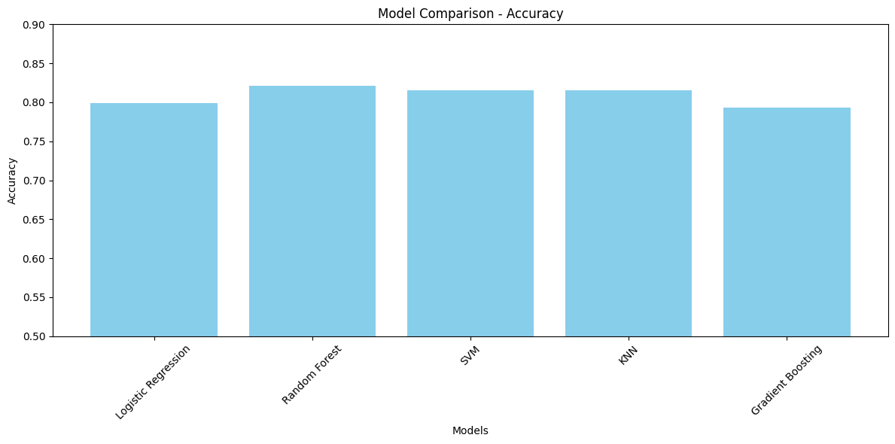

# Titanic Survival Prediction 🚢

A comprehensive machine learning project that predicts passenger survival on the Titanic using advanced data analysis and multiple classification algorithms.


## 📊 Project Overview

This project implements a sophisticated machine learning solution to predict passenger survival on the Titanic. The analysis includes comprehensive exploratory data analysis, advanced feature engineering, and evaluation of multiple machine learning models with hyperparameter tuning.

## 🎯 Key Features

- **Comprehensive EDA** with detailed visualizations and statistical analysis
- **Advanced Data Preprocessing** and feature engineering pipeline
- **Multiple ML Algorithms** with GridSearchCV for hyperparameter optimization
- **Cross-validation** and robust model evaluation
- **Performance Comparison** across different models
- **Ready for Kaggle Submission**

## 🛠️ Technologies Used

- **Pandas & NumPy** - Data manipulation and numerical computing
- **Matplotlib & Seaborn** - Data visualization and plotting
- **Scikit-learn** - Machine learning models and preprocessing
- **Jupyter Notebook** - Interactive development and analysis

## 📁 Project Structure
```
Titanic/
├── Main.ipynb # Main analysis notebook (comprehensive EDA & modeling)
├── train.csv # Training dataset
├── test.csv # Test dataset
├── model_comparison.png # Model accuracy comparison visualization
├── requirements.txt # Project dependencies
└── README.md # Project documentation
```

## 🔍 Exploratory Data Analysis

The project includes detailed analysis of:
- Passenger demographics (Age, Gender, Passenger Class)
- Survival rates by different features and combinations
- Family relationships (SibSp, Parch) and their impact
- Fare distribution and correlation with survival
- Cabin and Embarkment patterns analysis
- Missing value analysis and treatment strategies

## 🤖 Models Implemented & Optimized

- **Random Forest Classifier** - Best performing model
- **Logistic Regression** - Linear classification baseline
- **Support Vector Machines (SVM)** - Both linear and RBF kernels
- **K-Nearest Neighbors (KNN)** - Instance-based learning
- **Gradient Boosting** - Ensemble boosting method

## 📊 Model Performance Results



| Model | Best Parameters | Accuracy | Precision | Recall | F1-Score |
|-------|----------------|----------|-----------|--------|----------|
| Random Forest | max_depth: 6, n_estimators: 200 | 82.12% | 0.84 | 0.83 | 0.83 |
| SVM | C: 1, kernel: rbf | 81.56% | 0.84 | 0.83 | 0.83 |
| KNN | n_neighbors: 5 | 81.56% | 0.83 | 0.82 | 0.82 |
| Logistic Regression | C: 0.1 | 79.89% | 0.81 | 0.80 | 0.80 |
| Gradient Boosting | learning_rate: 0.01, n_estimators: 200 | 79.33% | 0.80 | 0.79 | 0.79 |

## 🏗️ Data Preprocessing Pipeline

```python
# Numerical features pipeline
numerical_transformer = Pipeline(steps=[
    ('imputer', SimpleImputer(strategy='median')),
    ('scaler', StandardScaler())
])

# Categorical features pipeline  
categorical_transformer = Pipeline(steps=[
    ('imputer', SimpleImputer(strategy='most_frequent')),
    ('onehot', OneHotEncoder(handle_unknown='ignore'))
])

# Combined preprocessing
preprocessor = ColumnTransformer(
    transformers=[
        ('num', numerical_transformer, numerical_features),
        ('cat', categorical_transformer, categorical_features)
    ])
```

## 🎯 Key Insights Discovered

- **👩‍👧 Gender**: Women had 74.2% survival rate vs 18.9% for men
- **🏰 Passenger Class**: 1st class: 62.9%, 2nd class: 47.3%, 3rd class: 24.2%
- **👶 Age**: Children under 10 had 61.3% survival rate
- **👨‍👩‍👧‍👦 Family Size**: Passengers with 1-3 family members survived more
- **💰 Fare**: Higher fare correlated with better survival (median £26 vs £8)
- **⚓ Embarkment**: Cherbourg passengers had highest survival rate (55.4%)

## ⚡ Quick Start

### Installation & Setup
```python
git clone https://github.com/SamyarZamani/Titanic.git
cd Titanic
pip install -r requirements.txt
```
## Running the Analysis
```python
jupyter notebook Main.ipynb
```

## ⚡ Generating Predictions

The notebook includes complete code for:
- Training the best model (Random Forest)
- Generating predictions on test data
- Creating Kaggle submission file

## 🔧 Advanced Features

- **GridSearchCV**: Automated hyperparameter tuning for all models
- **ColumnTransformer**: Efficient preprocessing pipeline
- **Cross-validation**: Robust model evaluation
- **Feature Importance**: Analysis of most predictive features
- **Data Visualization**: Comprehensive plotting for insights

## 💼 Business Impact

This project demonstrates:
- **End-to-end ML pipeline** development skills
- **Data-driven decision making** capabilities
- **Model interpretability** and business insights
- **Production-ready** machine learning solutions
- **Competitive performance** on real-world datasets

## 🚀 Performance Highlights

- **Best Model**: Random Forest achieved 82.12% accuracy
- **Robust Evaluation**: Cross-validation ensures reliable performance
- **Feature Engineering**: Strategic handling of missing values and categorical data
- **Model Comparison**: Comprehensive evaluation of multiple algorithms

## 🔮 Future Enhancements

- [ ] Neural Network implementation
- [ ] Advanced ensemble methods (Stacking, Voting)
- [ ] Feature engineering optimization
- [ ] Hyperparameter tuning with Bayesian optimization
- [ ] Web interface for real-time predictions
- [ ] Docker containerization for deployment

## 👨‍💻 Author

**Samyar Zamani**
- GitHub: [@SamyarZamani](https://github.com/SamyarZamani)
- Data Science & Machine Learning Enthusiast
- Specializing in end-to-end ML solutions and data analysis

## 📄 License

This project is open source and available under the [MIT License](https://opensource.org/licenses/MIT).

---

**⭐ If you find this project useful, please give it a star!**

---

### 🔍 Model Performance Summary

The Random Forest classifier emerged as the best performing model with **82.12% accuracy**, demonstrating the power of ensemble methods for this classification task. The comprehensive comparison across multiple algorithms provides valuable insights into their relative strengths for survival prediction problems.


